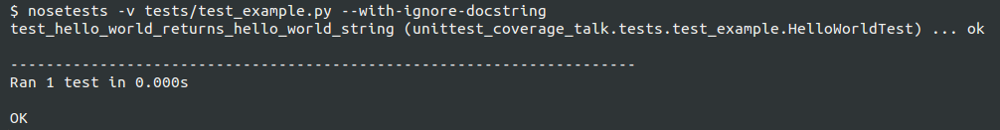

Unit Test Coverage Tool, Your Friendly Illusionist
==================================================

A dive into Python unit test coverage

About Presenter
===============

* Name: Chris Morales
* Formerly worked in Audio/Video and Electrical Fields
* Started learning Development approx. 4 years ago
* Work at Newcars.com / Cars.com
* Help organize SoCal Python
* Fun fact about me: **In my spare time I dabble in magic**

What we will cover
==================

* What is coverage?
* Different types of provable coverage such as line coverage,
  statement coverage, branch coverage.
* What approaches and questions to ask yourself when writing unit tests.

Let's Start
===========

We all seen it, we all heard it, we all proudly proclaimed it:

            **I got 100% unittest coverage!**

.. image:: ../assets/smiley_sunglasses.png

What is Code Coverage
=====================

In computer science, code coverage is a measure used to describe the degree to
which the source code of a program is executed when a particular test suite
runs.

What is Code Coverage (cont.)
==============================

A program with high code coverage, measured as a percentage, has had more of
its source code executed during testing which **SUGGESTS** it has a lower
chance of containing undetected software bugs compared to a program with low
code coverage.

How is Code Coverage Usually Measured
=====================================

Many different metrics can be used to calculate code coverage; some of the most
basic are the percent of program subroutines and the percent of program
statements called during execution of the test suite.

How can we do this in Python
============================

1. We write a lot of tests
2. **pip install nose and coverage** packages
3. Run **nosetests --with-coverage**
4. testrunner/coverage MAGIC happens
5. We see coverage percentage!

Note: instead of nosetests you can use `pytest`

Running nosetest testrunner with coverage
=========================================

.. image:: ../screenshots/example_one_test.png

Sidebar: Why am I giving this talk
==================================

In the last few years, as I wrote code I often did it for projects that
already had a test suite.

As such, I ran something like **nosetests** many times and have come to rely
and trust it.

Sidebar: However ...
====================

As I mentioned I dabbled in magic, so I naturally wondered what **MAGIC** is
behind test runner.

What's more, since I have long since learned that magic is an illusion I was
now TERRIBLY concerned as to whether coverage tool does what I think it does.

Sidebar: Then I Had A Scary Thought ...
=======================================

What if all this time I've been wrong to rely on the coverage tool.

Sidebar: About Coverage Package
===============================

Remember we pip installed the coverage package?

The `coverage` package is a popular, stable tool that iis written and
maintained by "Ned Batchelder and others"

It is a utility designed to work together with a test runner like nose
or pytest and show you the code coverage.

Coverage documentation: https://coverage.readthedocs.io

Back to Coverage
================

Now let's do go over example of code, tests and test coverage

Hello World Function
====================

Here we have a classic "Hello World" example.

.. code:: python
    :class: prettyprint lang-python

    def hello_world():
    '''Return a string of "Hello World"'''

        return "Hello World"

Hello World Function Test Cases
===============================

And here is it's only possible test case.

.. code:: python
    :class: prettyprint lang-python

    import unittest

    class HelloWorldTest(unittest.TestCase):

        def _callFUT(self):
            '''Imports & calls function under test & returns its output'''

            from unittest_coverage_talk.example import hello_world
            return hello_world()

        def test_hello_world_returns_hello_world_string(self):
            '''
            Test that the string returned by hello_world method is equal
            to "Hello World"
            '''

            expected_return = "Hello World"
            returned_value = self._callFUT()

            self.assertEqual(expected_return, returned_value)

Structuring Tests
=================

Warning!!! Opinions!!!

I use a specific testing structure which I want take a few minutes to describe
so we are all on the same page.

Structuring Tests: Folders and Files
====================================

1. Code is placed under the project folder
2. Tests are place under under test subfolder in the project folder
3. Test files are named by combining prefix of **test_** with the name of the
   file of the file being tested.

.. image:: ../screenshots/tree_output_1.png

This allows the test runner (nosetests) to know where to look for the tests

Structuring Our Tests: Unittest Module
======================================

Tests in this presentation use the standard **unittest** module that comes
with Python standard library.

1. Import the unit test module
2. Create a test case by making a class that inherits from unittest.TestCase.

   This will tell the test runner (and coverage utility) which of my python
   code is a test.

.. code:: python
    :class: prettyprint lang-python

    import unittest

    class HelloWorldTest(unittest.TestCase):
        # ...

Structuring Tests: Test Unit
============================

* Our test unit here is the function **hello_world**.
* So our test case will only test **hello_world** outputs
* The rule is: **One test case for one unit** for clarity and readability

Structuring Tests: _callFUT
===========================

**_callFUT** is a helper method is used to import and call the function being
tested.

Having function we test in one place ensures consistency since the method is
only ever imported and ran there across multiple tests for the test case.

.. code:: python
    :class: prettyprint lang-python

    class HelloWorldTest(unittest.TestCase):

        def _callFUT(self):
            '''Imports & calls function under test & returns its output'''

            from unittest_coverage_talk.example import hello_world
            return hello_world()

Structuring Tests: Expectation and Returns
==========================================

1. Define expected return
2. Call function under test
3. Assert the expected return and return of function under test are equal

.. code:: python
    :class: prettyprint lang-python

        def test_hello_world_returns_hello_world_string(self):
            '''
            Test that the string returned by hello_world method is equal
            to "Hello World"
            '''

            expected_return = "Hello World"
            returned_value = self._callFUT()

            self.assertEqual(expected_return, returned_value)

Structuring Tests: Documenting the Test
=======================================

* Documenting your test with what it does and expects
* This will help you identify it during test runner runs
* It will make your co-workers and FUTURE you happy as they won't have to guess
  what you wanted the test to do 6 months from now

.. code:: python
    :class: prettyprint lang-python

        def test_hello_world_returns_hello_world_string(self):
            '''
            Test that the string returned by hello_world method is equal
            to "Hello World"
            '''

.. image:: ../screenshots/test_example_1_with_docstring.png

Structuring Tests: Naming the Test
=======================================

* Name the function explicitly as there are usually many similar but not
  identical test cases.
* Compare: **test_returns** and

* Alternatively you can **pip install nose-ignore-docstring** package

Sources
=======

Wikipedia: https://en.wikipedia.org/wiki/Code_coverage
