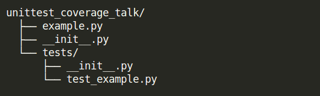

Unit Test Coverage Tool, Your Friendly Illusionist
==================================================

A dive into Python unit test coverage

About Presenter
===============

* Name: Chris Morales
* Formerly worked in Audio/Video and Electrical Fields
* Started learning Development approx. 4 years ago
* Work at Newcars.com / Cars.com
* Help organize SoCal Python
* Fun fact about me: **In my spare time I dabble in magic**

What we will cover
==================

* What is coverage?
* Code Coverage in Python
* Structuring Your Tests
* Line Coverage
* Statement Coverage
* Branch Coverage

Let's Start
===========

We all seen it, we all heard it, we all proudly proclaimed it:

            **I got 100% unittest coverage!**

.. image:: ../assets/smiley_sunglasses.png

What is Code Coverage
=====================

In computer science, code coverage is a measure used to describe the degree to
which the source code of a program is executed when a particular test suite
runs.

What is Code Coverage (cont.)
==============================

A program with high code coverage, measured as a percentage, has had more of
its source code executed during testing which **SUGGESTS** it has a lower
chance of containing undetected software bugs compared to a program with low
code coverage.

How is Code Coverage Usually Measured
=====================================

Many different metrics can be used to calculate code coverage; some of the most
basic are the percent of program subroutines and the percent of program
statements called during execution of the test suite.

Code coverage when developing in Python
=======================================

There are few tools out there, but we will only focus on one.

The `coverage` package is a popular, stable tool that is written and
maintained by "Ned Batchelder and others"

It is a tool designed to work together with a test runners like nose
or pytest and show you the code coverage.

Coverage documentation: https://coverage.readthedocs.io

How it usually works
====================

1. We write a lot of tests
2. **pip install nose and coverage** packages
3. Run **nosetests --with-coverage**
4. testrunner/coverage MAGIC happens
5. We see coverage percentage!

Running nosetest testrunner with coverage
=========================================

Here is what coverage output looks like:

.. image:: ../screenshots/example_one_test.png

Sidebar: Why am I giving this talk
==================================

In the last few years, as we wrote code we often did it for projects that
already had a test suite.

As such, we ran something like **nosetests** many times and have come to rely
and trust it.

Sidebar: However ...
====================

As I mentioned I dabbled in magic, so we naturally wondered what **MAGIC** is
behind test runner.

What's more, since I have long since learned that magic is an illusion we were
now TERRIBLY concerned as to whether coverage tool does what I think it does.

Sidebar: Then I Had A Scary Thought ...
=======================================

What if all this time I've been wrong to rely on the coverage tool.

.. image:: ../assets/smiley_scared.png

Let's write a simple test
=========================

First we will need ALL OF JAVASCRIPT ... KIDDING!!!

Hello World Function
====================

Here we have a classic "Hello World" example.

.. code:: python
    :class: prettyprint lang-python

    def hello_world():
    '''Return a string of "Hello World"'''

        return "Hello World"

Hello World Function Test Cases
===============================

And here is it's only possible test case.

.. code:: python
    :class: prettyprint lang-python

    import unittest

    class HelloWorldTest(unittest.TestCase):

        def _callFUT(self):
            '''Imports & calls function under test & returns its output'''

            from unittest_coverage_talk.example import hello_world
            return hello_world()

        def test_hello_world_returns_hello_world_string(self):
            '''
            Test that the string returned by hello_world method is equal
            to "Hello World"
            '''

            expected_return = "Hello World"
            returned_value = self._callFUT()

            self.assertEqual(expected_return, returned_value)

Structuring Tests
=================

Warning!!! Opinions!!!

We use a specific testing structure which we want take a few minutes to
describe so we are all on the same page.

Structuring Tests: Folders and Files
====================================

1. Code is placed under the project folder
2. Tests are place under **test** subfolder in the project folder
3. Test files are named by combining prefix of **test_** with the name of the
   file of the file being tested.

This allows the test runner (nosetests) to know where to look for the tests

Structuring Our Tests: Unittest Module
======================================

Tests in this presentation use the standard **unittest** module that comes
with Python standard library.

1. Import the unit test module
2. Create a test case by making a class that inherits from
   **unittest.TestCase.**

   This will tell the test runner (and coverage tool) which of our python
   code is a test.

.. code:: python
    :class: prettyprint lang-python

    import unittest

    class HelloWorldTest(unittest.TestCase):
        # ...

Structuring Tests: Test Unit
============================

* Our test unit here is the function **hello_world**.
* So our test case will only test **hello_world** outputs
* The rule is: **One test case for one unit** for clarity and readability

Structuring Tests: _callFUT
===========================

**_callFUT** is a helper method is used to import and call the function being
tested.

Having the function we are testing in one place ensures consistency since the
method is only ever imported and runs in _callFUT. It is a useful trick.

.. code:: python
    :class: prettyprint lang-python

    class HelloWorldTest(unittest.TestCase):

        def _callFUT(self):
            '''Imports & calls function under test & returns its output'''

            from unittest_coverage_talk.example import hello_world
            return hello_world()

Structuring Tests: Expectation and Returns
==========================================

1. Define expected return in **expected_return**
2. Call function under test and assign it's return to **returned_value**
3. Assert the **expected_return** and **returned_value** are equal

.. code:: python
    :class: prettyprint lang-python

    def test_hello_world_returns_hello_world_string(self):
        '''
        Test that the string returned by hello_world method is equal
        to "Hello World"
        '''

        expected_return = "Hello World"
        returned_value = self._callFUT()

        self.assertEqual(expected_return, returned_value)

Structuring Tests: Documenting the Test
=======================================

* Document your test with what it does and expects
* It will help FUTURE YOU and team mates avoid guessing

.. code:: python
    :class: prettyprint lang-python

    def test_hello_world_returns_hello_world_string(self):
        '''
        Test that the string returned by hello_world method is equal
        to "Hello World"
        '''

* It will also generate HUMAN readable test run output

Structuring Tests: Naming the Test
==================================

* Name the function explicitly as there are usually many similar but not
  identical test cases.
* Bad name: **test_hello_world_returns**
* Good name: **test_hello_world_returns_hello_world_string**

.. code:: python
    :class: prettyprint lang-python

    def test_hello_world_returns_hello_world_string(self):
      # ...

Structuring Tests: Naming the Test (cont.)
==========================================

You can also show the test function name and it's location if you
**pip install nose-ignore-docstring** package.

.. image:: ../screenshots/test_example_1_without_docstring.png

Let's talk types of Code coverages
==================================

Commonly used metrics are

* Line coverage
* Statement coverage
* Branch coverage

Line Coverage
=============

This is one of the most common coverage metrics used. When the test runs, the
lines that were executed are recorded. If all lines of the code ran it implies
full coverage.

Line Coverage: The Betrayal
===========================

Line coverage is a *LIE!!!* for Python and most language that can run more then
one statement on one line.

.. code:: python
    :class: prettyprint lang-python

    print "this is"; print "a lie"

Try to never think of line coverage, think **STATEMENT COVERAGE** instead.

Statement Coverage
==================

This is the second most common coverage metrics used. When the test runs, the
statements that were executed are recorded. If all statements of the code ran
it implies full coverage.

Statement Coverage: Get Number Example
======================================

.. code:: python
    :class: prettyprint lang-python

    def get_number(odd_number=False):
        """
        Return 1 if odd_number flag is True or 2 if odd_number flag is
        False
        """
        number = 2
        if odd_number is True:
            number = 1

        return number

Statement Coverage: Get Number Test
===================================

.. code:: python
    :class: prettyprint lang-python

    import unittest

    class GetNumberTest(unittest.TestCase):

        def _callFUT(self, odd_number):
            """Import get_number FUT, call it with passed odd_number"""
            from unittest_coverage_talk.example2 import get_number
            return get_number(odd_number)

        def test_get_number_return_int_value_of_one(self):
            """
            Test if get_number returns 1 when odd_number=True is
            passed in
            """
            test_odd_number = True
            expected_number = 1
            returned_number = self._callFUT(test_odd_number)

            self.assertEqual(expected_number, returned_number)

Statement Coverage: Get Number Test Coverage
============================================

So let's see what our coverage is now?

Statement Coverage: Celebration Hand Pump
=========================================

Statement Coverage: Betrayal Once More
======================================

This coverage is of course a lie. If you look at the code or read the docstring
for **get_number** you will see there are **two** possible outputs when
you run the function (it returns 1 or 2).

.. code:: python
    :class: prettyprint lang-python

    def get_number(odd_number=False):
        """
        Return 1 if odd_number flag is True or 2 if odd_number flag is
        False
        """
        number = 2
        if odd_number is True:
            number = 1

        return number

And our current test only covers one of those case, when it return 1!

Statement Coverage: Adding More Tests
=====================================

Let's add a second test

.. code:: python
    :class: prettyprint lang-python

    import unittest

    class GetNumberTest(unittest.TestCase):

        # ...

        def test_get_number_return_int_value_of_two(self):
            """
            Test if get_number returns 2 when odd_number=False is
            passed in
            """
            test_odd_number = False
            expected_number = 2
            returned_number = self._callFUT(test_odd_number)

            self.assertEqual(expected_number, returned_number)

Statement Coverage: Can We Trust Noone?
========================================

We are still getting 100% coverage!? This time it is correct though as both
cases are covered.

However it tells us that coverage tricked us again.

Statement Coverage: No Hope
===========================

Statement coverage is also a *LIE!!!* since code can be written in the way
where 100% the statements have been executed but not all **branches** of your
code ran.

It can still be useful during development assuming you know it might trick you.

We Mentioned Code Branches
==========================

When a function has multiple outcomes what you are really saying there are
multiple branches of code that are executed which return different results.

In our case:

.. code:: python
    :class: prettyprint lang-python

    if odd_number is True
            / \
           /   \
         yes    no
         /       \
    return 1   return 2

Maybe we can use that to our benefit?

Code Branches: Code Rewrite
===========================

Maybe we can still use statement coverage if we somehow could NOT run the
statements that are not covered by the first test. Let's try this:

.. code:: python
    :class: prettyprint lang-python

    def get_number(odd_number=False):
        """
        Return 1 if odd_number flag is True or 2 if odd_number flag is False
        """

        if odd_number is True:
            number = 1
        else:
            number = 2

        return number

Statement Coverage: A New Hope
==============================

As you can see now coverage shows up that we missed **1 statement** and that it
is missing on **line 11**.

This is line 11:

.. code:: python
    :class: prettyprint lang-python

    else:
        number = 2

Statement Coverage: New Hope Explained
======================================

That "else block" in the previous iteration of our code was handled
**implicitly** be setting *number = 2* before the if statement.

So the statement **ALWAYS** ran and was reported as such by coverage.

.. code:: python
    :class: prettyprint lang-python

    def get_number(odd_number=False):
        """
        Return 1 if odd_number flag is True or 2 if odd_number flag is False
        """
        number = 2
        if odd_number is True:
            number = 1

        return number

Code Refactors Like This Are Highly Recommended
===============================================

What we did there is refactor the code to have **EXPLICIT** code branches.

   **This is a highly recommended solution.**

Do not be put off by "well, this is more code". What you really have there is
**MORE READABLE CODE**.

Sidebar: --cover-erase
======================

Quick note. You might have noticed that we added **--cover-erase** argument
to our **nosetests** command.

This is necessary because the coverage tool caches coverage results in a file
called *.coverage* for performance. However, it does not always know when to
invalidate this cache.

We strongly suggest using **--cover-erase** options for all your runs.

Branch Coverage
===============

Branch coverage is yet another coverage metric. It is much more accurate since
it works by calculating possible branches of code and recording those that ran
and those that did not.

You can get branch coverage from statement coverage alone if you write your
code in the explicit manner like we did above.

Branch Coverage: Return of The Coverage Tool
============================================

Calculating possible code branches is not always easy but the coverage tool
does a pretty good job. Let's run tests for example2 with only **ONE** test:

.. code:: python
    :class: prettyprint lang-python

    import unittest

    class GetNumberTest(unittest.TestCase):

        def _callFUT(self, odd_number):
            """Import get_number FUT, call it with passed odd_number"""
            from unittest_coverage_talk.example2 import get_number
            return get_number(odd_number)

        def test_get_number_return_int_value_of_one(self):
            """
            Test if get_number returns 1 when odd_number=True is
            passed in
            """
            test_odd_number = True
            expected_number = 1
            returned_number = self._callFUT(test_odd_number)

            self.assertEqual(expected_number, returned_number)

Branch Coverage: Comparison
===========================

Let's also do a compassion of coverage report with and without branch coverage.
Below test exact same code with and without **--cover-branches** argument.

Branch Coverage: Comparison, No Branch Coverage
===============================================

So, without branch coverage:

Branch Coverage: Comparison, Branch Coverage
============================================

And with branch coverage:

This shows the missing branch coverage and the approximate location of where.

Branch Coverage: Branch Coverage, The Code
==========================================

Coverage tool also has an ability to generate an html report which will
show you which lines have partial coverage if you use **--cover-html**
argument.

Branch Coverage: Branch Coverage, The Explicit Code
===================================================

Let's also see what the report looks like for the **refactored** version of the
code where only 1 test runs.

It shows us the same missing partial, but not the missing statement

Branch Coverage: Branch Coverage, We Love you
=============================================

As you can see branch coverage is the most comprehensive coverage we have can
use. The coverage will allow you to catch most of those conditions and has
useful reports to help you.

Still we strongly recommend that you refactor you code to have be explicit
enough that using statement coverage you can get full coverage.

Branch Coverage: It Still Lies
==============================

Despite the wonderful work done by coverage tool team the branch coverage
analysis done by the coverage is still incomplete. Something called
**peep hole** optimizations can still mess up your coverage.

Since the topic is rather involved we would rather try to show and explain it
one on one to those who are interested. But you can read all about it here:

https://bitbucket.org/ned/coveragepy/issues/198/continue-marked-as-not-covered

Questions
=========

?