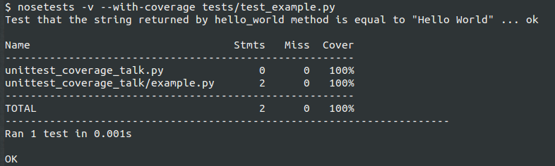

Unit Test Coverage Tool, Your Friendly Illusionist
==================================================

A dive into Python unit test coverage

About Presenter
===============

* Name: Chris Morales
* Formerly worked in Audio/Video and Electrical Fields
* Started learning Development approx. 4 years ago
* Work at Newcars.com / Cars.com
* Help organize SoCal Python
* Fun fact about me: **In my spare time I dabble in magic**

Let's Start
===========

We all seen it, we all heard it, we all proudly proclaimed it:

            **I got 100% unittest coverage!**

What is Code Coverage
=====================

In computer science, code coverage is a measure used to describe the degree to
which the source code of a program is executed when a particular test suite
runs.

What is Code Coverage (cont.)
==============================

A program with high code coverage, measured as a percentage, has had more of
its source code executed during testing which **SUGGESTS** it has a lower
chance of containing undetected software bugs compared to a program with low
code coverage.

How is Code Coveage Usually Measured
====================================

Many different metrics can be used to calculate code coverage; some of the most
basic are the percent of program subroutines and the percent of program
statements called during execution of the test suite.

How can we do this in Python
============================

1. We write a lot of tests
2. **pip install nose and coverage** packages
3. Run **nosetests --with-coverage**
4. testrunner/coverage MAGIC happens
5. We see coverage percentage!

Note: instead of nosetests you can use `pytest`

Example
=======

Running nosetest testrunner with coverage

Sidebar: Why am I giving this talk
==================================

In the last few years, as I wrote code I often did it for projects that
already had a test suite.

As such I ran something like **nosetests** many times and have come to rely
and trust it.

Sidebar: However ...
====================

As I mentioned I dabbled in magic, so I naturally wondered what is this
**MAGIC** is behind test runner.

What's more, since I have long since learned that magic is an illusion I was
now TERRIBLY concerned as to whether coverage tool does what I think it does

About Coverage Package
======================

One of the golden standards is the `coverage` package written and maintained
by "Ned Batchelder and others" (https://pypi.python.org/pypi/coverage)

It is a utility designed to work together with a test runner like nose
or pytest and show you how much of your code ran when you ran your unittests

Sources
=======

Wikipedia: https://en.wikipedia.org/wiki/Code_coverage
